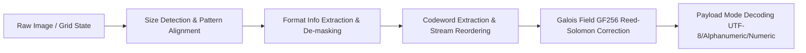

# 🔲 QRaster - Matrix QR Code Editor, Analyzer & Decoder

[](https://opensource.org/licenses/MIT)
[]()
[]()
[]()

**QRaster** is an experimental, cross-platform interactive 2D matrix QR Code editor, visualizer, and decoder built strictly according to **ISO/IEC 18004** specification. 

It allows users to manually draw, inspect, edit individual matrix modules, automatically construct structural patterns (Finder, Timing, Alignment), evaluate real-time matrix readability, and decode binary payloads using a custom **Galois Field $GF(256)$ Reed-Solomon Error Correction Engine**.

---

> [!WARNING]
> **Experimental Proof of Concept & Known Limitations**  
> **QRaster** is a conceptual prototype created for educational, research, and matrix analysis purposes. It is **not** a commercial production-grade QR scanner. The image auto-detection and Reed-Solomon de-masking pipeline may exhibit errors or fail to decode severely distorted, tilted, or non-standard version matrices. Contributions and bug fixes from the community are warmly welcome!

---

## 📖 Table of Contents

- [📌 Introduction & Motivation](#-introduction--motivation)
- [📐 Technical Architecture & Math](#-technical-architecture--math)
- [📁 Project Structure](#-project-structure)
- [🚀 Quick Start & Installation](#-quick-start--installation)
  - [🌐 Web Application](#-web-application)
  - [🪟 Windows Desktop](#-windows-desktop)
  - [🐧 Linux Desktop](#-linux-desktop)
  - [🍎 macOS Desktop](#-macos-desktop)
- [⌨️ Comprehensive User Manual](#️-comprehensive-user-manual)
- [💾 File Format Specification](#-file-format-specification)
- [🐛 Known Limitations & Open Bugs](#-known-limitations--open-bugs)
- [📝 Changelog](#-changelog)
- [🤝 Contributing](#-contributing)
- [📜 License](#-license)

---

## 📌 Introduction & Motivation

Most QR code software acts as a black box: you input text, get an image out, or scan an image to get text. 

**QRaster** demystifies the 2D barcode format by exposing every single module (pixel) in an interactive grid canvas. Users can examine how structural patterns function, experiment with error correction capabilities by selectively corrupting modules, and watch the real-time Readability Meter react dynamically as data bytes are placed or altered.

### Key Highlights
- **Interactive Grid Editing**: Toggle cell state (Black ↔ White) via Mouse, Keyboard Arrow Keys, or Space/Enter keys.
- **Single-Click Pattern Presets**: Instantly inject 7x7 Finder Patterns, Timing Patterns, and version-dependent Alignment grids.
- **Custom Reed-Solomon Engine**: Full Galois Field $GF(256)$ math using primitive polynomial $p(x) = x^8 + x^4 + x^3 + x^2 + 1$ ($0x11D$).
- **Multi-Format Export & Import**: Work with JSON structural arrays, Plain Text matrices, CSV files, high-res PNG images, or SVG vectors.

---

## 📐 Technical Architecture & Math

The decoding pipeline follows the ISO/IEC 18004 specification:



1. **Galois Field $GF(256)$ Arithmetic**:
   - Multiplication and division are performed using precomputed exponentiation and logarithm tables over generator $\alpha = 2$.
   - Addition and subtraction operate via bitwise XOR operations (`^`).

2. **Syndrome Calculation & Berlekamp-Massey**:
   - Evaluates syndromes $S_k = P(\alpha^k)$ for $k = 0 \dots 2t - 1$.
   - If syndromes are non-zero, the Berlekamp-Massey algorithm computes the error locator polynomial $\Lambda(x)$.
   - Chien search identifies exact error locations, followed by Forney's algorithm for error magnitude evaluation.

3. **Mask Pattern De-masking**:
   - Tests all 8 standard XOR mask formulas ($0 \dots 7$) to unmask module data bits before payload extraction.

---

## 📁 Project Structure

```text
QRaster/
├── .gitignore          # Excludes build caches, executable artifacts, and OS files
├── README.md             # Complete documentation and developer guide
├── web/                # Standalone Web Application
│   ├── index.html      # HTML5 Semantic Layout & Interactive Help Modal
│   ├── styles.css      # Custom CSS design system, responsive grid & themes
│   └── app.js          # JS GF(256) Engine, Decoder & Canvas Manager
├── windows/            # Windows Desktop Application
│   ├── main.py         # Tkinter GUI, Image Sampler & GF(256) RS Engine
│   ├── app.ico         # Native Application Icon
│   ├── run.bat         # Direct Launcher Script
│   └── build_exe.bat   # PyInstaller EXE Build Pipeline
├── linux/              # Linux Desktop Application
│   ├── main.py         # Linux Compatible GUI Engine
│   ├── icon.png        # Window Icon
│   ├── run.sh          # Bash Launcher
│   ├── build.sh        # PyInstaller Binary Build Script
│   └── qraster.desktop # Desktop Entry Descriptor
└── macos/              # macOS Desktop Application
    ├── main.py         # macOS Tkinter Application (Cmd key support)
    ├── icon.png        # macOS Icon
    ├── run.sh          # Shell Script Launcher
    └── build_app.sh    # macOS Bundle Creation Script
```

---

## 🚀 Quick Start & Installation

### Prerequisites
- **Web**: Any modern browser (Chrome, Firefox, Safari, Edge).
- **Desktop (Windows/Linux/macOS)**: Python 3.8 or higher with `tkinter` installed (standard with Python installers). No heavy external dependencies required!

---

### 🌐 Web Application

Simply open `web/index.html` directly in your browser:

```bash
# Optional: Serve locally using Node.js
npx serve web
```

---

### 🪟 Windows Desktop

Run directly via Python:

```cmd
python windows/main.py
```

Or double-click `windows/run.bat`.

To build a standalone `.exe`:
```cmd
windows\build_exe.bat
```

---

### 🐧 Linux Desktop

```bash
chmod +x linux/run.sh
./linux/run.sh
```

To build a Linux binary:
```bash
chmod +x linux/build.sh
./linux/build.sh
```

---

### 🍎 macOS Desktop

```bash
chmod +x macos/run.sh
./macos/run.sh
```

---

## ⌨️ Comprehensive User Manual

| Action | Control / Shortcut | Description |
| :--- | :--- | :--- |
| **Cell Toggle** | `Mouse Left Click` | Inverts color of clicked cell (White ↔ Black) |
| **Grid Navigation** | `↑` `↓` `←` `→` Arrow Keys | Moves active selection highlight box |
| **Keyboard Paint** | `Space` / `Enter` | Toggles active cell color; hold & move arrows to paint continuous lines |
| **Undo Action** | `Ctrl + Z` / `Cmd + Z` | Reverts up to 50 previous grid state changes |
| **Redo Action** | `Ctrl + Y` / `Cmd + Y` | Restores undone changes |
| **Finder Patterns** | `Finder Patterns` Button | Draws standard 7x7 structural boxes at 3 matrix corners |
| **Timing Lines** | `Timing Patterns` Button | Generates alternating black/white timing lines on Row 7 and Column 7 |
| **Alignment Grid** | `Alignment Patterns` Button | Draws sub-alignment boxes for Versions 2–40 |
| **Export File** | `Save File` / `Save Matrix ▾` | Saves current matrix state as JSON, TXT, CSV, PNG, or SVG |
| **Import File** | `Open File` | Imports JSON/TXT/CSV matrix or loads PNG/JPG/BMP images with auto-size detection |

---

## 💾 File Format Specification

### 1. JSON Format (`.json`)
```json
{
  "gridSize": 21,
  "matrix": [
    [1, 1, 1, 1, 1, 1, 1, 0, ...],
    [1, 0, 0, 0, 0, 0, 1, 0, ...]
  ]
}
```

### 2. Text / CSV Format (`.txt` / `.csv`)
Raw lines of `1` (Black module) and `0` (White module), delimited by commas or newlines:
```text
1,1,1,1,1,1,1,0,0,1,...
1,0,0,0,0,0,1,0,1,0,...
```

---

## 🐛 Known Limitations & Open Bugs

1. **Non-Standard Perspective Distortion**: Image thresholding uses bounding-box sampling. Images with severe skew or rotation ($> 15^\circ$) may fail module sampling.
2. **High Version Complexity**: QR versions above Version 10 ($> 57 \times 57$) have dense data blocks; manual drawing without complete mask structure will yield low readability scores.
3. **Format Info Hamming Distance**: Current version uses direct XOR masking lookup; damaged format strings may require manual format pattern correction.

---

## 📝 Changelog

### Version 1.2.0 (Latest)
- 🌐 Added multi-format export: JSON, Plain Text, CSV, PNG, SVG.
- 📂 Universal file import: Auto-parses JSON, TXT, CSV matrices and PNG/JPG/BMP image files.
- 🌍 Complete English UI and user guide translation across all 4 platforms.
- 🧹 Cleaned build environment and unified cross-platform project structure.

### Version 1.1.0
- 🧮 Replaced mock score calculation with full Galois Field $GF(256)$ Reed-Solomon error correction.
- 🔍 Implemented 8 XOR mask pattern de-masking engines.
- 📖 Integrated 4-tab interactive documentation window and technical QR guide.

### Version 1.0.0
- 🎉 Initial proof-of-concept launch with matrix grid editor and baseline pattern generators.

---

## 🤝 Contributing

Contributions are greatly appreciated! If you find a bug, want to improve the image processing pipeline, or add new features:

1. Fork the Project.
2. Create your Feature Branch (`git checkout -b feature/AmazingFeature`).
3. Commit your Changes (`git commit -m 'Add some AmazingFeature'`).
4. Push to the Branch (`git push origin feature/AmazingFeature`).
5. Open a Pull Request.

---

## 📜 License

Distributed under the **MIT License**. See `LICENSE` for more information.
